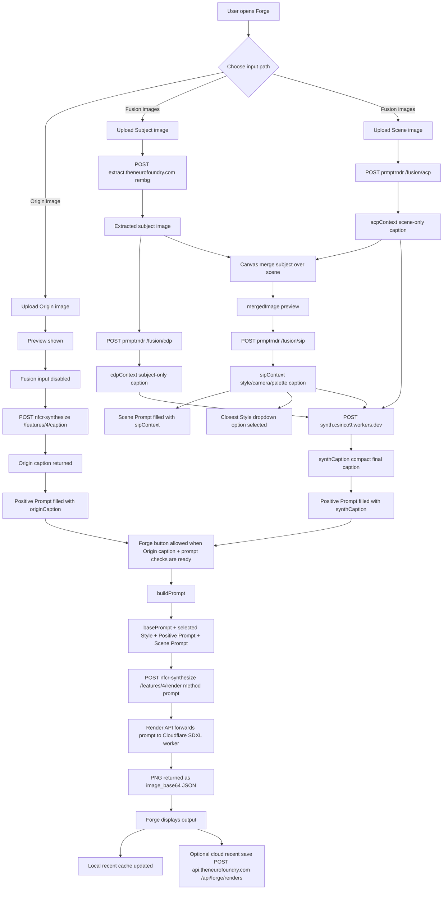

# Forge Current Image Pipeline Map

This reflects the current live Forge flow after the Origin captioning, Fusion routing, and Cloudflare CORS fixes.

## High-Level Flow



## Origin Path

Origin is now caption-first:

1. User uploads one Origin image.
2. Forge previews the image and disables Fusion inputs.
3. Forge calls `https://nfcr-synthesize.onrender.com/features/4/caption`.
4. Request includes:

```json
{
  "image_base64": "data:image/...",
  "instruction": "ORIGIN_CAPTION_INSTRUCTION"
}
```

5. Returned caption becomes `originCaption`.
6. `originCaption` fills Positive Prompt.
7. Forge render uses `originCaption` as `basePrompt`.

Origin does not send the original image into the final render call right now. It sends the caption/prompt only.

## Fusion Path

Fusion currently uses Subject and Scene. Style image input exists visually but remains locked.

1. Subject image goes through background extraction.
2. Extracted subject is captioned through CDP:

```text
POST https://prmptrndr.csirico9.workers.dev/fusion/cdp
```

3. Scene image is captioned through ACP:

```text
POST https://prmptrndr.csirico9.workers.dev/fusion/acp
```

4. Forge merges the extracted subject over the scene locally in a canvas.
5. The merged preview is captioned through SIP:

```text
POST https://prmptrndr.csirico9.workers.dev/fusion/sip
```

6. SIP output fills Scene Prompt.
7. SIP output also tries to select the closest Style dropdown option.
8. CDP, ACP, and SIP are sent to Synth:

```text
POST https://synth.csirico9.workers.dev
```

9. Synth returns `synthCaption`.
10. `synthCaption` fills Positive Prompt.

## Final Render Prompt

Both Origin and Fusion call `buildPrompt(basePrompt)` before rendering.

Prompt order:

```text
basePrompt, selected Style, Positive Prompt, Scene Prompt
```

Duplicate copies of `basePrompt` are skipped when Positive Prompt or Scene Prompt exactly match it.

Final render request:

```text
POST https://nfcr-synthesize.onrender.com/features/4/render
```

Request shape:

```json
{
  "method": "prompt",
  "prompt": "final built prompt",
  "negative_prompt": "negative prompt text",
  "model": "@cf/stabilityai/stable-diffusion-xl-base-1.0",
  "width": 1024,
  "height": 576,
  "guidance_scale": 7.5,
  "num_inference_steps": 25
}
```

Response shape:

```json
{
  "ok": true,
  "image_base64": "...",
  "saved_as": "Features/images/...",
  "prompt": "...",
  "method": "prompt"
}
```

## Current Known Side Paths

- `api.theneurofoundry.com/api/forge/renders` is the authenticated cloud recent-render save path. It stores up to 10 renders per user through the Neurofoundry API/R2 route when auth and R2 are available.
- Local Recent Crafts still update using browser storage and generated thumbnails, including for logged-out visitors.
- Auto-download is disabled in the live UI. Render outputs display in the Forge result popup and Recent Crafts; authenticated cloud save is attempted separately.
- `shared/page-transitions.js` ignores `download`, `data:`, and `blob:` links so manual/generated download links are not intercepted by page transitions.
- Loading cog art is served from `assets/loading/c2.png`, `c3.png`, and `c4.png`.
